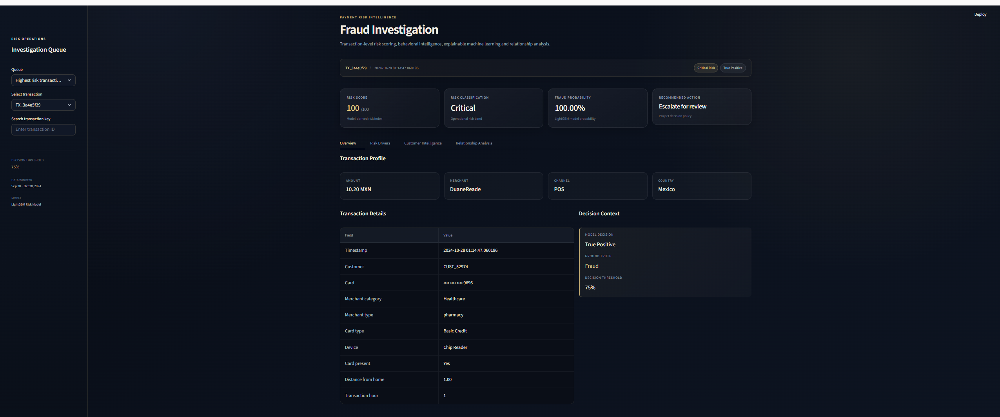
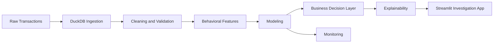
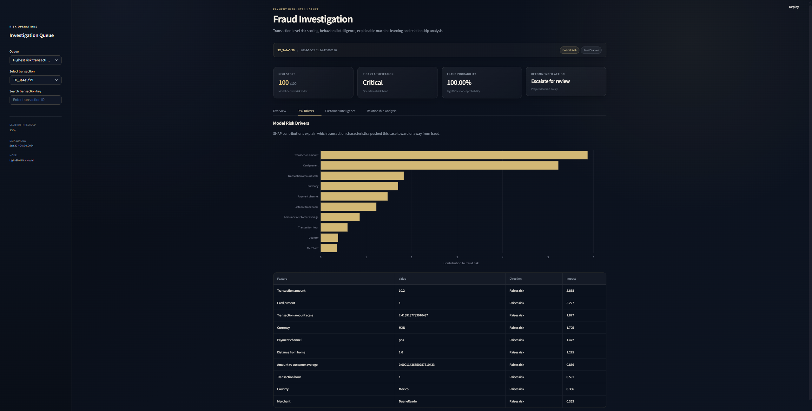
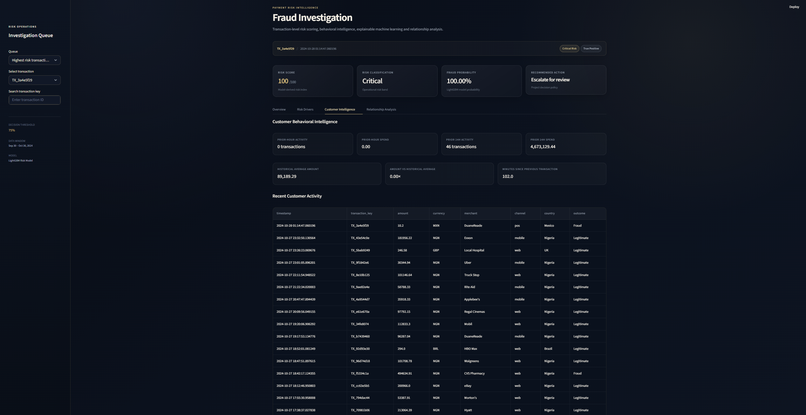
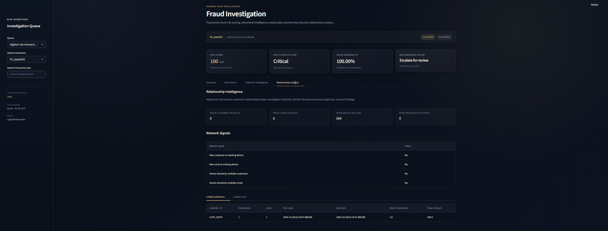

# Payment Fraud Risk Analysis

### From 7.48M transactions to an explainable fraud investigation system

I built this project to treat fraud detection as a full analytics workflow, not just a model. The project starts with raw payment data, builds time-aware behavioral features, trains and validates a fraud model, translates predictions into business decisions, and delivers the output through a Streamlit investigation app.

It uses **Python, SQL, DuckDB, LightGBM, SHAP, and Streamlit**.


---

## Project at a Glance

| Metric | Result |
|---|---:|
| Transactions processed | **7,483,766** |
| Customers | **4,869** |
| Cards | **5,000** |
| Merchants | **105** |
| Fraud rate | **19.97%** |
| Final test transactions | **1,206,491** |
| ROC-AUC | **0.9969** |
| PR-AUC | **0.9907** |
| Precision | **96.99%** |
| Recall | **93.36%** |
| F1 Score | **95.14%** |

---

## App Preview

<p align="center">
  
</p>

The app allows an analyst to review high-risk transactions, inspect customer behavior, understand model risk drivers, and investigate card-device-customer relationships.

---

## Workflow



---

## What I Built

### 1. Data Engineering
I processed **7.48M transactions** using DuckDB and SQL. During validation, I found **6,453 reused transaction IDs**. These were not simple duplicates, so I created a new unique analytical `transaction_key` instead of dropping valid rows.

### 2. Behavioral Feature Engineering
I built historical features that only use information available **before each transaction**, including prior transaction count, time since previous transaction, 1-hour and 24-hour velocity, customer average spend, and amount anomaly signals.

### 3. Modeling
I trained a Logistic Regression baseline and compared it with LightGBM using a **chronological split**.

| Model | ROC-AUC | PR-AUC | Best F1 |
|---|---:|---:|---:|
| Logistic Regression | 0.9705 | 0.9233 | 0.8365 |
| **LightGBM** | **0.9968** | **0.9906** | **0.9508** |

### 4. Final Test Performance
The final production candidate was evaluated on an untouched future period.

| Metric | Result |
|---|---:|
| Precision | **96.99%** |
| Recall | **93.36%** |
| F1 Score | **95.14%** |
| True Positives | **225,252** |
| False Positives | **6,994** |
| False Negatives | **16,019** |
| True Negatives | **958,226** |

### 5. Business Decisioning
I converted model output into operational fraud decisions using threshold analysis, risk bands, and review tradeoffs.

| Approach | Precision | Recall |
|---|---:|---:|
| Behavioral Rules | 58.07% | 41.44% |
| **ML Only** | **96.99%** | **93.36%** |
| ML + Behavioral Rules | 75.60% | 95.48% |

---

## Explainability

<p align="center">
  
</p>

I used **SHAP** to explain why a transaction was flagged. The strongest global drivers included **distance from home, card presence, transaction amount, currency, merchant, transaction hour, and payment channel**.

---

## Customer and Relationship Investigation

<p align="center">
  
</p>

<p align="center">
  
</p>

The app also supports customer behavior review and relationship analysis across cards, devices, and customers, making the project more useful than a standalone prediction file.

---

## What Made This Project Difficult

- **Large-scale data processing:** 7.48M rows required SQL and DuckDB instead of inefficient notebook-only workflows.
- **Messy identifiers:** repeated transaction IDs looked like duplicates but represented different records.
- **Leakage risk:** behavioral features had to be built carefully so they used only prior information.
- **Synthetic shortcut signals:** some network patterns were almost perfectly associated with fraud, so I kept them out of the main model to avoid inflated performance.
- **Business tradeoffs:** the best fraud catch rate was not automatically the best operational decision because higher recall also increased false alerts.

---

## Real Results vs Assumptions

This project uses a **synthetic transaction dataset**. The reported model metrics and fraud rates are real outputs from the project pipeline, but they should be treated as portfolio results, not real bank performance.

Some business-cost scenarios were tested with assumptions such as manual review cost and false-positive friction cost. These were used only for decision analysis and are **not real financial claims**.

---

## Repository Structure

```text
Payment_Fraud_Analysis/
├── app/
├── assets/
├── data/
├── docs/
├── reports/
├── src/
├── requirements.txt
└── README.md
```

---

## Run Locally

```bash
python -m venv .venv
```

```powershell
.\.venv\Scripts\Activate.ps1
pip install -r requirements.txt
streamlit run app/app.py
```

---

## What I Learned

This project strengthened how I think about analytics end to end: not just model building, but also data quality, leakage prevention, explainability, threshold tradeoffs, and how analytics should support real decisions.

---

## About Me

Hi, I'm **Nisha Rajkumar**, an **M.S. Business Analytics candidate at the University of Rochester Simon Business School**.

I enjoy working on projects involving messy data, SQL and Python workflows, business analysis, visualization, and machine learning when it adds real decision value.

I’m interested in roles across **Business Analytics, Data Analytics, BI, Risk Analytics, Operations Analytics, Product Analytics, and Strategy Analytics**.

[](https://www.linkedin.com/in/nisha-rajkumar)
[](https://github.com/nisha1234rana-lgtm)